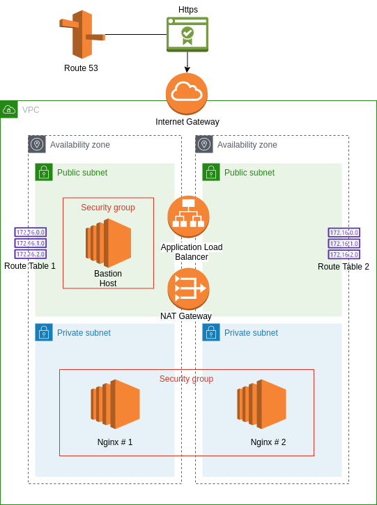
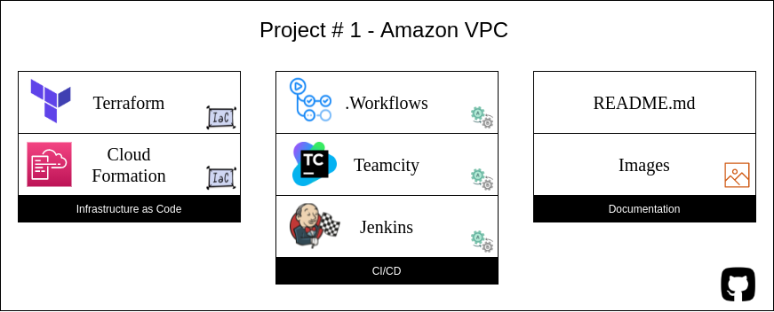

# Amazon VPC

The objective is create a simple architecture hosted on AWS with high availability (us-east-1b, us-east-1c), two Nginx Server with load balancing and domain with its certificate. 

Services used:
- Route 53
- Certificate Manager 
- EC2
- VPC

The following image shows the architecture:

Aditionally, I want to use some technologies for CI/CD processes:
- Github Actions
- Teamcity
- Jenkins

Finally, all infrastructure were wrote using IaC technologies:
- Cloud Formation
- Terraform

On this image you can see the repository organization:

Note: If you have questions about something please ask me. 